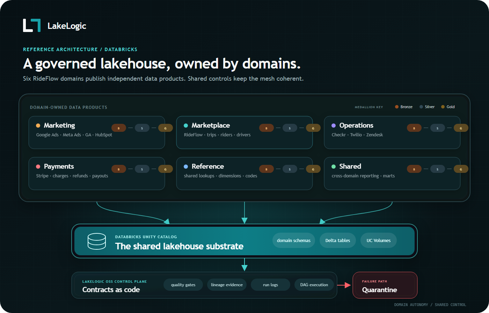
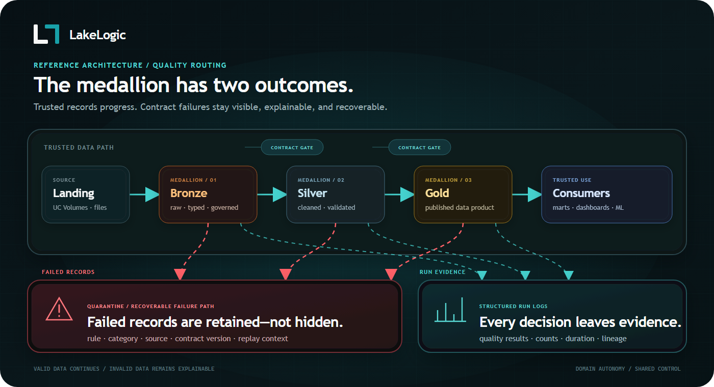
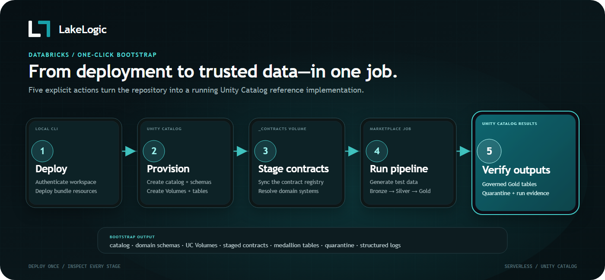
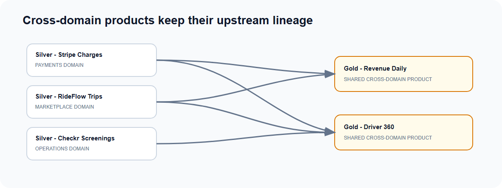

# Governed Data Mesh on Databricks — Data Contracts, Quarantine, and Quality Gates

A working reference implementation on **Databricks Unity Catalog**, built with
[LakeLogic](https://pypi.org/project/lakelogic/). Six domains from **RideFlow**, a
fictional ride-hailing and food-delivery company, each owning contract-governed
Bronze, Silver, and Gold data products — with failing rows quarantined and the
reason recorded.

Serverless. Unity Catalog Volumes only — no ADLS or external storage required.

> A community project from the LakeLogic team. Not an official Databricks product.

> **Pre-release:** Do not use this repository as a public quickstart until every
> blocking item in [`RELEASE_CHECKLIST.md`](RELEASE_CHECKLIST.md) is complete.
> The notebooks install the latest public [`lakelogic`](https://pypi.org/project/lakelogic/)
> release; the demo was developed and last verified against `lakelogic` 1.40.0.

## The problem

As a business grows, one central data team becomes a bottleneck. It cannot hold
the business context for every trip, payment, campaign, and support case.

Giving each domain ownership helps, but creates a new risk. Every team may build
quality checks, pipeline ordering, lineage, alerts, and failure handling in a
different way. Bad data can then reach reports even when every team believes its
own pipeline is working.

**The goal is simple: let domain teams own their data without making the wider
platform inconsistent or unsafe.**

## The solution

[LakeLogic](https://pypi.org/project/lakelogic/) gives every domain the same
contract-driven controls while allowing each team to own its business rules.

A contract defines what a dataset should contain, what quality level it must
meet, where it comes from, what depends on it, and how it should be written.
LakeLogic runs those contracts across Bronze, Silver, and Gold. It quarantines
failed rows, checks dataset-level thresholds and SLOs, records lineage, and runs
pipelines in dependency order.

**RideFlow** is a fictional ride-hailing and food-delivery company, similar to
Uber. This repository shows six RideFlow domains—Marketplace, Marketing,
Payments, Operations, Reference, and Shared—owning their data products on
Databricks without rebuilding the platform controls for every table.

## Why this matters

| Business problem | What this demo shows | Business value |
| --- | --- | --- |
| A central team becomes a ticket queue | Domains own their contracts and data products | Teams deliver changes faster |
| Bad records reach trusted reports | Failed rows go to quarantine with the exact reason | Users can trust the data that passes |
| Small failures and broken datasets are treated alike | Row quarantine and dataset-level quality gates are separate | Safe rows can continue while unsafe runs can stop |
| Every pipeline rebuilds the same controls | Quality, SLOs, lineage, DAG execution, and materialization come from shared contract machinery | Less repeated engineering |
| Teams cannot see the impact of a change | Dependencies connect products across domains | Problems are easier to trace and route |
| Historical dimensions require complex merge code | Gold contracts can declare SCD Type 2 materialization | Teams build consistent historical models faster |

## What you will prove

Run one bootstrap job and the demo will:

1. Create a Unity Catalog with domain schemas, landing Volumes, contract files,
   pipeline logs, and quarantine tables.
2. Generate RideFlow test data with deliberate errors.
3. Run Marketplace pipelines in Bronze → Silver → Gold order.
4. Respect dependencies between pipelines, including dependencies within a layer.
5. Keep passing rows moving when policy allows.
6. Fail the run when dataset-level quality limits are breached.
7. Build Gold products, including SCD Type 2 dimensions.
8. Run a smoke test that checks the advertised outputs.

The wider repository contains 66 contracts across the six domains. It includes
CSV, JSON, and unstructured PDF inputs, external Python logic, cross-domain Gold
products, row-level lineage tags, SLO checks, and an engine-agnostic pipeline DAG.

## Architecture

Each domain owns its source systems and Bronze, Silver, and Gold data products.
Shared policies can be inherited from `_domain.yaml` and `_system.yaml`, while
individual contracts keep dataset-specific rules close to the team that knows
the data.



*Six RideFlow domains publish governed data products through Unity Catalog.
LakeLogic applies shared contract controls and records quarantine and run
evidence.*

Inside a domain, data moves through the medallion layers. A row-level failure can
go to quarantine while passing rows continue. Dataset-rule failures, broken
schemas, runtime errors, or breached quality thresholds can still fail the run.



*Contracts govern every layer. Failed rows retain their error reasons, while run
logs record what passed, what failed, and why.*

## Open source and optional Cloud

The open-source `lakelogic` package runs the contracts, pipelines, SLO checks,
lineage, materialization, and quarantine flow shown in this repository. The core
demo needs no LakeLogic account or API key.

LakeLogic Cloud is optional. It uses metadata-only telemetry to add trust scores
and Zeus-assisted incident diagnosis. See
[Optional: LakeLogic Cloud](#optional-lakelogic-cloud) after completing the
open-source quickstart.

---

## Prerequisites

- A **Databricks workspace with Unity Catalog** and **serverless compute**
  enabled (Databricks Free Edition works).
- The [Databricks CLI](https://docs.databricks.com/dev-tools/cli/) (v0.220+)
  **authenticated to your workspace** — either OAuth
  (`databricks auth login --host <url> -p rideflow_dev`) or a personal access
  token (`databricks configure --host <url> --profile rideflow_dev`). Pass that
  profile to every `bundle` command with `-p rideflow_dev` (or set
  `DATABRICKS_CONFIG_PROFILE=rideflow_dev`) so it targets the right workspace.
- Privilege to create a catalog (metastore `CREATE CATALOG`). **No admin rights?**
  Ask someone to create an empty catalog for you and set `catalog` to it (below) —
  the setup step will just add schemas and volumes inside it.

---

## Quickstart

> **Every `databricks bundle` command must run from the `databricks/` folder** —
> that's where `databricks.yml` lives. Run one from the repo root (or a fresh
> terminal that reopened there) and you'll get:
> `Error: unable to locate bundle root: databricks.yml not found`.
> If you hit that, you're one level too high — `cd databricks` and retry.

```bash
git clone https://github.com/LakeLogic/lakelogic-databricks-data-mesh.git
cd lakelogic-databricks-data-mesh/databricks   # ← into databricks/, NOT the repo root

# Sanity check: this must find databricks.yml before any bundle command works.
ls databricks.yml            # Windows cmd/PowerShell: dir databricks.yml
                             # not found? you're one level too high — cd databricks

# 1. Sign in to YOUR workspace (opens a browser — finish the login, don't Ctrl-C)
databricks auth login --host https://<your-workspace>.azuredatabricks.net -p rideflow_dev
databricks -p rideflow_dev current-user me                 # verify auth works

# 2. Deploy the workflows (syncs contracts + notebooks, creates the jobs)
#    Still inside databricks/? If a new terminal reopened at the repo root, cd databricks first.
databricks bundle deploy -t dev -p rideflow_dev

# 3. Run the one-click bootstrap job
databricks bundle run rideflow_demo_bootstrap -t dev -p rideflow_dev

# 4. Clean up when you're done — BOTH commands are needed.
#    `catalogs delete` only removes the Unity Catalog (data); it does NOT remove
#    the deployed jobs or the synced workspace files — `bundle destroy` does.
databricks bundle destroy -t dev -p rideflow_dev                   # jobs + workspace files
databricks catalogs delete rideflow_dev_demo --force -p rideflow_dev   # catalog, schemas, volumes, data
```

**If `bundle destroy` leaves jobs or files behind** — e.g. you provisioned via the
no-CLI notebook, or the bundle state was reset — remove them directly (they live
outside the catalog, so `catalogs delete` never touches them):

```bash
# Workspace files
databricks workspace delete /Workspace/Shared/_data_platform_rideflow_demo --recursive -p rideflow_dev

# Jobs — list the demo's jobs (tagged `lakelogic`), then delete each by ID
databricks jobs list --output json -p rideflow_dev \
  | jq -r '.[] | select(.settings.tags.lakelogic != null) | .job_id' \
  | xargs -I{} databricks jobs delete {} -p rideflow_dev
```

Prefer a token over the browser flow? Create a PAT (workspace **Settings ▸
Developer ▸ Access tokens**), then `databricks configure --host <url> --profile
rideflow_dev` and paste it — this also sidesteps the legacy-credential error below.

That job — **`[dev] RideFlow Demo — 🚀 One-Click Bootstrap`** (bundle key
`rideflow_demo_bootstrap`) — does two things:

1. **`00_setup`** creates the catalog, one schema per domain, a `quarantine`
   schema, and a `nondelta` schema holding the UC Volumes (`_contracts`,
   `_logs`, `landing_<domain>`), then stages every contract into `_contracts`.
2. **Runs the marketplace medallion** end-to-end — generates synthetic landing
   data into the Volume, then processes bronze → silver → gold. The test-data
   step injects deliberate edge cases, so you'll see rows land in `quarantine`.

What that One-Click Bootstrap actually does:



*Figure 3 — One-click bootstrap sequence: a Databricks Asset Bundle deploy plus a single job that provisions Unity Catalog (catalog, schemas, Volumes), stages the contracts, then generates and processes the medallion with quarantine.*

Then look around:

```sql
USE CATALOG rideflow_dev_demo;
SHOW SCHEMAS;
SELECT * FROM marketplace.gold_rideflow_fact_trip_daily_kpis LIMIT 20;
SELECT * FROM quarantine.marketplace_silver_rideflow_trips LIMIT 20;
```

To populate the **full mesh**, run the other domain orchestrators the same way
(each is a deployed job named `… — Full Pipeline Orchestrator`), e.g.:

```bash
databricks bundle run payments_orchestrator_stripe -t dev
databricks bundle run marketing_orchestrator_google_ads -t dev
```

---

## No CLI? Provision it directly in Databricks

Don't want to touch the CLI, bundles, or profiles? Provision everything from a
single notebook — **no `databricks` CLI, no bundle deploy, no Terraform state:**

1. In Databricks: **Workspace ▸ Repos ▸ Add Repo** and clone this GitHub repo.
2. Open **`databricks/notebooks/_ops/provision_all`**, attach to serverless (or any
   UC-enabled cluster), and **Run All**.

It creates the catalog, schemas, UC Volumes, landing folders, and the (empty)
bronze/silver/gold **tables** — straight from the contracts. Widgets let you change
the `catalog` name or skip table creation. It's idempotent, so re-running is safe.

Then generate + process data by running a domain orchestrator job (deployed via the
bundle) or `test_data_driver.py` → `pipeline_driver.py` for a single system.

> The bundle Quickstart above and this notebook do the same provisioning — pick
> whichever you prefer. The notebook is the fastest way to *just see the catalog and
> tables appear*; the bundle adds the schedulable jobs.

---

## Run it step by step (see each stage before trusting the job)

The one-click **`… — 🚀 One-Click Bootstrap`** job just chains these notebooks
together — so running them by hand *is* the same flow, one stage at a time. Do this
for the `marketplace / rideflow` domain and you'll watch the catalog appear, then
landing data, then rows flowing into gold with the bad ones peeled off into
`quarantine`. Open each notebook, set the widgets, **Run All**, read the output.

**1. Provision the structures** — `_ops/provision_all`
Run All (widgets default to `catalog = rideflow_dev_demo`). Creates the catalog,
schemas, Volumes, landing folders, and empty tables.

**2. Generate landing data** — `test_data_driver`
- `registry_path` = `/Volumes/rideflow_dev_demo/nondelta/_contracts/marketplace/rideflow/_system.yaml`
- `environment` = `dev`  ·  `inject_edge_cases` = `true`
- Run All → writes synthetic data (with deliberate bad rows) into the landing Volume.

**3. Process the medallion** — `pipeline_driver`
- `registry_path` = *(same as above)*
- `environment` = `dev`  ·  `engine` = `spark`  ·  `storage_mode` = `uc`
- `target_layers` = `bronze,silver,gold`
- Run All → bronze → silver → gold; contract-failing rows are routed to `quarantine`.

**4. See what the contract caught**
```sql
USE CATALOG rideflow_dev_demo;
SHOW TABLES IN marketplace;    -- the bronze/silver/gold products
SHOW TABLES IN quarantine;     -- one table of rejected rows per contract
SELECT * FROM marketplace.gold_rideflow_fact_trip_daily_kpis LIMIT 20;
-- then SELECT from a quarantine table listed above to see the rejected rows + rule
```
Or run `_helpers/inspect_quarantine`.

To do another domain, point `registry_path` at its system (e.g.
`…/_contracts/payments/stripe/_system.yaml`) and repeat steps 2–3. Table names come
from the contracts under `domains_rideflow/`.

> Note: `pipeline_driver`'s `reset_layers` widget defaults to dropping + recreating
> the layers each run (clean re-runs). Leave it for a fresh demo; clear it to append.

---

## What gets created

```
Catalog: rideflow_dev_demo
├── nondelta            (schema for operational Volumes)
│   ├── _contracts      (Volume — the staged contract registry the driver reads)
│   ├── _logs           (Volume — pipeline run logs)
│   └── landing_<domain>(Volume — the landing zone; a UC Volume, NOT ADLS)
├── quarantine          (schema — contract-failing rows land here)
├── marketplace         (schema — bronze/silver/gold Delta tables)
├── marketing
├── payments
├── operations
├── reference           (shared lookups + conformed dimensions)
└── shared              (cross-domain marts: driver-360, revenue, CAC, marketplace health)
```

### Use your own catalog (any name, existing or new)

`rideflow_dev_demo` is only the default — the catalog name is a **single source of
truth** and everything (schemas, Volumes, and table names) follows it. To use a
different or already-existing catalog, change it in **one** place:

- **Bundle / jobs:** set `catalog` in
  [`databricks/databrick_variables.yml`](databricks/databrick_variables.yml) (or per
  target in [`databricks/databricks.yml`](databricks/databricks.yml)). It flows into
  the job `registry_path` (`/Volumes/<catalog>/…`), and the drivers derive the
  catalog from that path — so table names, Volumes and schemas all land in your catalog.
- **Manual notebooks:** set the `catalog` widget on `00_setup` / `provision_all`; for
  `pipeline_driver` / `test_data_driver`, point `registry_path` at
  `/Volumes/<your-catalog>/nondelta/_contracts/<domain>/<system>/_system.yaml`.

The catalog just has to **exist and be writable** — it does not have to be named
`rideflow_dev_demo`. (On a Default-Storage workspace, create it once in the UI, or reuse
an existing one such as `workspace`.)

---

## Cross-domain data products & lineage (the real mesh)

What makes this a mesh (not four silos) is the gold layer, where domains consume
each other's products. Each cross-domain contract declares its upstream
dependencies explicitly, so lineage crosses domain boundaries on the record:



*Figure 4 — Cross-domain lineage: gold marts (`gold_fact_revenue_daily`, `gold_dim_driver_360`) are built from silver products owned by different domains (payments, marketplace, operations), so data lineage crosses team boundaries on the record.*

When `gold_fact_revenue_daily` breaks, you can trace it back through the mesh to
the first upstream product that dropped — across teams. That's the lineage Zeus
walks to route an incident to the accountable domain.

---

## Catch bad data — contract enforcement & quarantine in action

Test data ships with injected edge cases, but you can widen the break: open the
`… — Test Data` job for a domain and raise the edge-case volume, or re-run a
processing layer after tampering with a landing file. The gold product won't
absorb the bad rows — they're held in `quarantine`, tagged with the contract
rule they violated.

---

## Optional: LakeLogic Cloud

To light up the **trust score + Zeus**, store your keys in a Databricks secret
scope (never hardcode them) and point the pipeline at them:

```bash
databricks secrets create-scope rideflow
databricks secrets put-secret rideflow lakelogic-observatory-endpoint
databricks secrets put-secret rideflow lakelogic-api-key
```

Then uncomment the two `dbutils.secrets.get(...)` lines in
[`databricks/notebooks/pipeline_driver.py`](databricks/notebooks/pipeline_driver.py).
Runs then publish to LakeLogic Cloud, where each product earns a live trust
score and Zeus diagnoses any incident.

---

## Repo layout

```
domains_rideflow/            The data contracts — one tree per domain/system
                             (bronze/silver/gold YAML + _domain.yaml governance)
databricks/
  databricks.yml             DAB bundle (targets: dev / stage / prod)
  databrick_variables.yml    Bundle variables (catalog name, etc.)
  notebooks/
    _ops/00_setup.py         Provisions catalog/schemas/volumes + stages contracts
    pipeline_driver.py       Registry-driven medallion runner (bronze→silver→gold)
    test_data_driver.py      Generates landing data into the UC Volume
    _helpers/ _ops/ gold/     Contract validation, lineage, SCD2 processors, …
  resources/
    _bootstrap/              The one-click bootstrap job
    <domain>/                Per-domain/-system jobs (test_data/bronze/silver/gold/
                             orchestrator/maintenance) on serverless compute
```

---

## Troubleshooting

- **`unable to locate bundle root: databricks.yml not found`** — run `bundle`
  commands from the `databricks/` folder (`cd databricks`), not the repo root.
- **`stored credentials from older CLI versions are no longer used`** — your
  `.databrickscfg` has a legacy OAuth token. Re-authenticate and finish the browser
  login (don't Ctrl-C):
  `databricks auth login --host https://<your-workspace>.azuredatabricks.net -p rideflow_dev`.
  Or use a PAT: `databricks configure --host <url> --profile rideflow_dev`. Last
  resort — keep the file cache with `set DATABRICKS_AUTH_STORAGE=plaintext` (Windows)
  / `export DATABRICKS_AUTH_STORAGE=plaintext` (macOS/Linux).
- **Deploy targets the wrong workspace host** — the bundle uses your **DEFAULT**
  profile unless you pass `-p`. Always add `-p rideflow_dev` (or set
  `DATABRICKS_CONFIG_PROFILE=rideflow_dev`) so it hits the workspace you signed into.
- **`--profile … conflicts with --host …`** — a profile already carries its own
  host, so don't pass `--host` *and* `-p` to the same command. To point a profile at
  a different workspace, re-run `databricks auth login`/`configure` with the new
  `--host` (it overwrites the profile).
- **Deleting / cleaning up old profiles** — there's no `databricks profiles delete`
  command. Profiles live in `~/.databrickscfg` (Windows: `%USERPROFILE%\.databrickscfg`).
  Remove one by deleting its `[profile-name]` header line and every line beneath it up
  to the next `[` (e.g. a `[rideflow_dev]` block runs until the next `[…]` section).
- **`CREATE CATALOG` fails / `Metastore storage root URL does not exist`** — your
  workspace uses **Default Storage** (common on Free Edition / trials), or you lack
  the `CREATE CATALOG` privilege, so a bare `CREATE CATALOG` can't allocate storage.
  Fix: create the catalog **once in the UI** (Catalog ▸ Create catalog ▸ name it
  `rideflow_dev_demo` ▸ Default Storage ▸ Create), then re-run. Or point `catalog`
  (the notebook widget / `databrick_variables.yml`) at an existing catalog
  (`SHOW CATALOGS`, e.g. `workspace`) — `00_setup` then just adds the schemas and
  volumes inside it.
- **`workspace_id mismatch: provider is configured for workspace X but got Y`** —
  you deployed to one workspace, then pointed at another (common with trial
  workspaces). The bundle's cached Terraform state still references the old one.
  Clear it and redeploy: delete the `databricks/.databricks/` folder
  (`rmdir /s /q .databricks` on Windows, `rm -rf .databricks` otherwise), then
  `databricks bundle deploy -t dev -p rideflow_dev`. Tip: run `bundle destroy`
  *before* switching workspaces so the old one's jobs are cleaned up first.
  **Or just use the self-healing wrapper** — `./deploy.ps1` (Windows) or
  `./deploy.sh` (macOS/Linux) — which detects this error, clears the stale state,
  and redeploys automatically.

---

## Security

This repo runs entirely on Unity Catalog and needs **no secrets** for the core
demo. If you enable LakeLogic Cloud telemetry, keep the endpoint and API key in a
**Databricks secret scope** — never commit them to a notebook. The `catalog`
name is the only value you may want to change.

---

## Teardown

Full rollback is two steps — the bundle owns the **jobs**, but the **Unity Catalog
objects** are created at runtime by `00_setup`, so `destroy` doesn't remove them:

```bash
# from the databricks/ folder
databricks bundle destroy -t dev -p rideflow_dev          # jobs + synced workspace files
databricks catalogs delete rideflow_dev_demo --force -p rideflow_dev   # catalog, schemas, volumes, tables, data
```

`--force` cascades. Equivalent to `DROP CATALOG rideflow_dev_demo CASCADE;` in a SQL
editor. Check first with `databricks bundle summary -t dev -p rideflow_dev`.

---

## Take it further

Run the same contracts against your own data:

```bash
pip install lakelogic
```

- **Docs:** <https://lakelogic.github.io/LakeLogic/>
- **Package:** <https://pypi.org/project/lakelogic/>

If this saved you time, a ⭐ helps other data engineers find it.

---

*Topics: data-contracts · data-mesh · databricks · unity-catalog · data-quality ·
medallion-architecture · data-governance · data-observability · databricks-asset-bundles ·
delta-lake · data-products · lakelogic. A worked reference for data engineers evaluating
data-contract enforcement and data-quality tooling on the Databricks lakehouse.*
