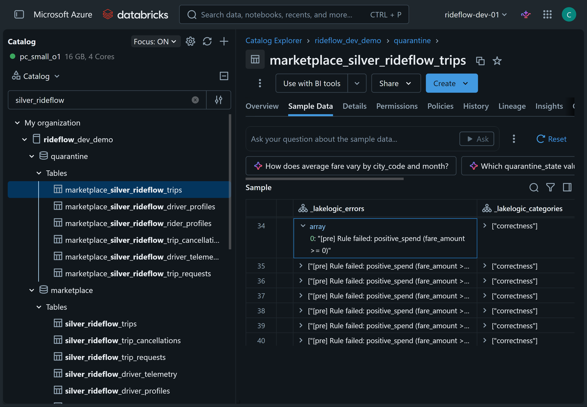
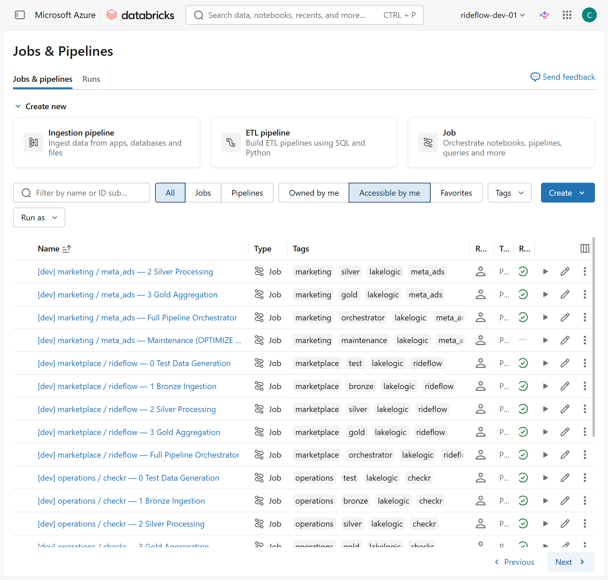
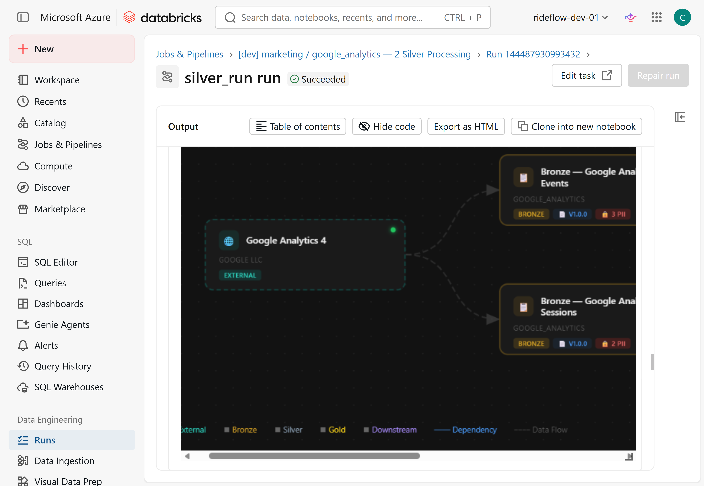
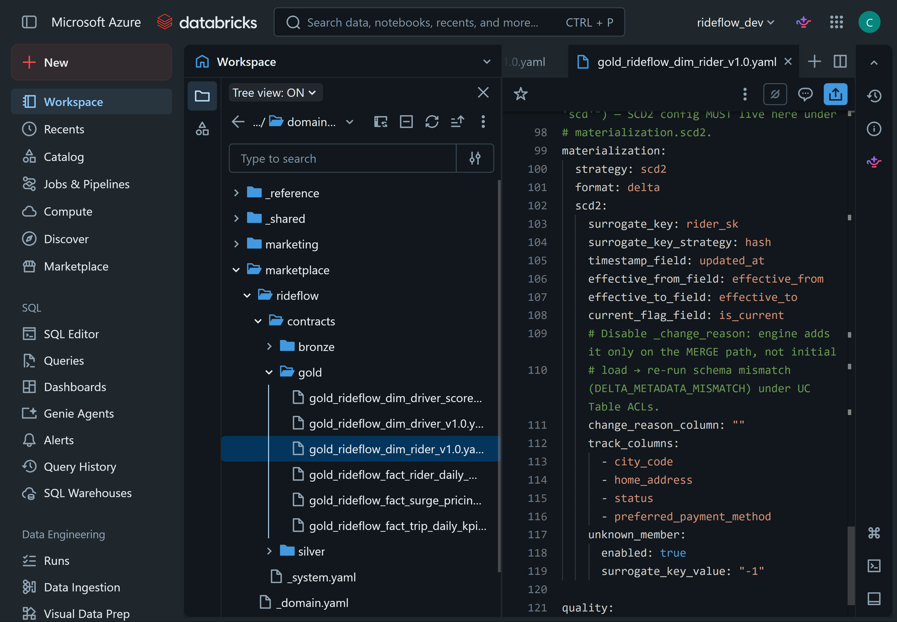

# Governed Data Mesh on Databricks — Data Contracts, Quarantine, and Quality Gates

A working reference implementation of a **domain-driven lakehouse built around
data-mesh principles**, powered by
[LakeLogic](https://pypi.org/project/lakelogic/) on Databricks Unity Catalog. It
shows how domain teams can own
Bronze, Silver, and Gold data products while sharing the same contract-driven
quality, quarantine, lineage, and pipeline controls.

The example uses **RideFlow**, a fictional ride-hailing and food-delivery business
similar to Uber. Six domains own their data products without rebuilding the
platform controls for every table. The core demo runs on serverless compute and
Unity Catalog Volumes, with no ADLS or external storage required.


*Six RideFlow domains publish governed data products through Unity Catalog.
LakeLogic applies shared contract controls and records quarantine and run evidence.*

> A community project from the LakeLogic team, not an official Databricks product.
> The notebooks install the latest public [`lakelogic`](https://pypi.org/project/lakelogic/)
> release so the demo picks up the newest fixes.

## What this proves

One central data team cannot effectively hold the business context for every
domain—for example, trips, payments, marketing campaigns, and customer support.
Domain ownership addresses that bottleneck, but without shared controls it can
produce inconsistent quality checks, lineage, alerts, and failure handling.

This repository demonstrates a middle path:

- **Domain ownership:** teams own their contracts and data products.
- **Shared controls:** schema checks, row rules, dataset gates, SLO checks, lineage,
  and dependency-aware execution use common machinery.
- **Explained quarantine:** failed rows are retained with the contract rule and
  diagnostic context that rejected them.
- **Safe continuation:** valid rows can continue when policy permits, while broken
  schemas or breached dataset thresholds can still fail the run.
- **Cross-domain products:** declared dependencies connect products across team
  boundaries.
- **Declarative Gold models:** contracts can configure materialization such as
  Slowly Changing Dimension Type 2.



*A real quarantine table in Unity Catalog. Rejected records keep their
`_lakelogic_errors`, categories, and source instead of being silently dropped.*

## Run it

### Prerequisites

- A Databricks workspace with **Unity Catalog** and **serverless compute** enabled.
  Databricks Free Edition works.
- [Databricks CLI v0.220 or later](https://docs.databricks.com/dev-tools/cli/),
  authenticated to the target workspace.
- Permission to create a catalog. If you do not have it, ask an administrator to
  create an empty catalog and grant you permission to create schemas and Volumes
  inside it. See [catalog configuration](docs/catalog-configuration.md).

### Five-minute Quickstart

Every bundle command must run from the repository's `databricks/` directory,
where `databricks.yml` is located.

```bash
git clone https://github.com/LakeLogic/lakelogic-databricks-data-mesh.git
cd lakelogic-databricks-data-mesh/databricks

# Confirm that you are at the bundle root.
ls databricks.yml            # Windows PowerShell or cmd: dir databricks.yml

# Authenticate and verify the identity that will deploy the demo.
databricks auth login --host https://<your-workspace>.azuredatabricks.net -p rideflow_dev
databricks -p rideflow_dev current-user me

# Deploy the workflows and run the bootstrap job.
databricks bundle deploy -t dev -p rideflow_dev
databricks bundle run rideflow_demo_bootstrap -t dev -p rideflow_dev
```

The bootstrap job:

1. Creates the catalog, domain schemas, `quarantine` schema, and operational
   Unity Catalog Volumes.
2. Stages the contracts into the `_contracts` Volume.
3. Generates synthetic RideFlow landing data with deliberate edge cases.
4. Processes the Marketplace system through Bronze, Silver, and Gold.
5. Runs a smoke test against the advertised outputs.


*The bundle deploys the jobs. The bootstrap job provisions Unity Catalog, stages
the contracts, generates data, and processes the medallion with quarantine.*

### Verify the result

Run this in a Databricks SQL editor:

```sql
USE CATALOG rideflow_dev_demo;
SHOW SCHEMAS;
SHOW TABLES IN marketplace;
SHOW TABLES IN quarantine;

SELECT *
FROM marketplace.gold_rideflow_fact_trip_daily_kpis
LIMIT 20;
```

Inspect one of the returned quarantine tables to see the rejected records and
their error context.

To populate another domain after deployment, run its orchestrator. For example:

```bash
databricks bundle run payments_orchestrator_stripe -t dev -p rideflow_dev
databricks bundle run marketing_orchestrator_google_ads -t dev -p rideflow_dev
```



*The deployed Databricks Workflows include domain and source-specific
orchestrators for Marketplace, Marketing, Payments, Operations, and shared data
products.*

## How the architecture works

Each domain owns source systems and Bronze, Silver, and Gold products. Shared
settings can be inherited from `_domain.yaml` and `_system.yaml`; individual
contracts keep dataset-specific rules beside the team that understands the data.

The repository contains 66 contracts across Marketplace, Marketing, Payments,
Operations, Reference, and Shared. The examples include CSV, JSON, unstructured
PDF input, external Python logic, cross-domain Gold products, row-level lineage
tags, freshness and volume SLOs, and an engine-agnostic pipeline DAG.

### Medallion plus quarantine


*Contracts govern every layer. Row failures can enter quarantine while valid rows
continue; dataset gates can still stop an unsafe run.*

Quarantine is a failure path, not another medallion layer. A rejected row retains
the failed rule and source context. Structured run logs record what passed, what
failed, and how long each contract took.

### Dependency-aware execution

Contracts declare `depends_on` edges. LakeLogic builds the directed acyclic graph
and processes products in dependency order, including dependencies within the
same medallion layer.



### Cross-domain products

Shared Gold products can consume products owned by other domains. Their declared
dependencies preserve lineage across team boundaries.


*The shared revenue and driver products depend on data owned by Payments,
Marketplace, and Operations.*

### SCD Type 2

Gold contracts can declare SCD Type 2 materialization, including tracked columns,
surrogate keys, effective dates, current-version flags, and an unknown member.



## Choose your setup path

The Quickstart is the canonical route for the complete job-based demo. Use these
guides when you need a different path:

| Goal | Guide |
| --- | --- |
| Provision directly from a Databricks notebook without the CLI | [No-CLI setup](docs/no-cli-setup.md) |
| Run setup, test data, and medallion processing one stage at a time | [Manual run](docs/manual-run.md) |
| Use a different or existing Unity Catalog catalog | [Catalog configuration](docs/catalog-configuration.md) |
| Resolve authentication, bundle-state, workspace, or cleanup failures | [Troubleshooting](docs/troubleshooting.md) |

## What gets created

```text
Catalog: rideflow_dev_demo
├── nondelta
│   ├── _contracts       Unity Catalog Volume containing the staged registry
│   ├── _logs            Unity Catalog Volume containing pipeline run logs
│   └── landing_<domain> Unity Catalog Volume containing source data
├── quarantine           Contract-failing rows
├── marketplace          Bronze, Silver, and Gold Delta tables
├── marketing
├── payments
├── operations
├── reference            Shared lookups and conformed dimensions
└── shared               Cross-domain marts
```

## Repository layout

```text
domains_rideflow/             Contract trees organised by domain and system
databricks/
  databricks.yml              Asset Bundle targets
  databrick_variables.yml     Shared bundle variables
  notebooks/
    _ops/00_setup.py          Catalog, schema, Volume, and contract setup
    pipeline_driver.py        Registry-driven Bronze, Silver, and Gold runner
    test_data_driver.py       Synthetic landing-data generator
    _helpers/                 Inspection and validation helpers
  resources/
    _bootstrap/               One-click bootstrap job
    <domain>/                 Domain and system jobs
docs/                         Alternative setup and troubleshooting guides
```

## Open source and optional Cloud

The open-source `lakelogic` package runs the contracts, pipeline ordering, SLO
checks, lineage metadata, materialization, and quarantine flow shown here. The
core demo requires no LakeLogic account or API key.

LakeLogic Cloud is optional. It accepts metadata-only telemetry for product-health
views and Zeus-assisted incident diagnosis. Cloud capabilities are separate from
the open-source reference implementation and require their own endpoint and API
key, stored in a Databricks secret scope.

## Security

The core demo needs no application secrets. If you enable optional Cloud
telemetry, store the endpoint and API key in a Databricks secret scope. Never
commit credentials to a notebook or contract.

## Tear down the demo

The Asset Bundle owns the jobs and synced workspace files. The setup notebook
creates the Unity Catalog objects at runtime. Remove both:

```bash
# Run from the databricks/ directory.
databricks bundle destroy -t dev -p rideflow_dev
databricks catalogs delete rideflow_dev_demo --force -p rideflow_dev
```

The catalog deletion cascades through its schemas, Volumes, tables, and data.
Confirm the catalog name before running it. See [troubleshooting](docs/troubleshooting.md)
when bundle state is missing or resources remain.

## Take it further

Install LakeLogic and apply the same contract model to your own data:

```bash
pip install lakelogic
```

- **Documentation:** <https://lakelogic.github.io/LakeLogic/>
- **Package:** <https://pypi.org/project/lakelogic/>

If this reference implementation saved you time, a GitHub star helps other data
engineers find it.
