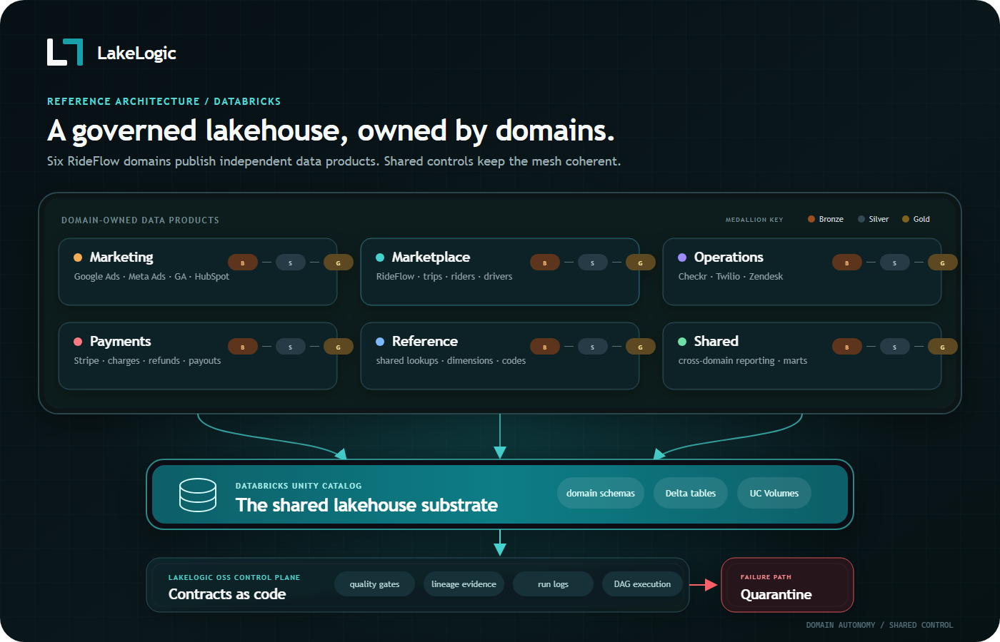
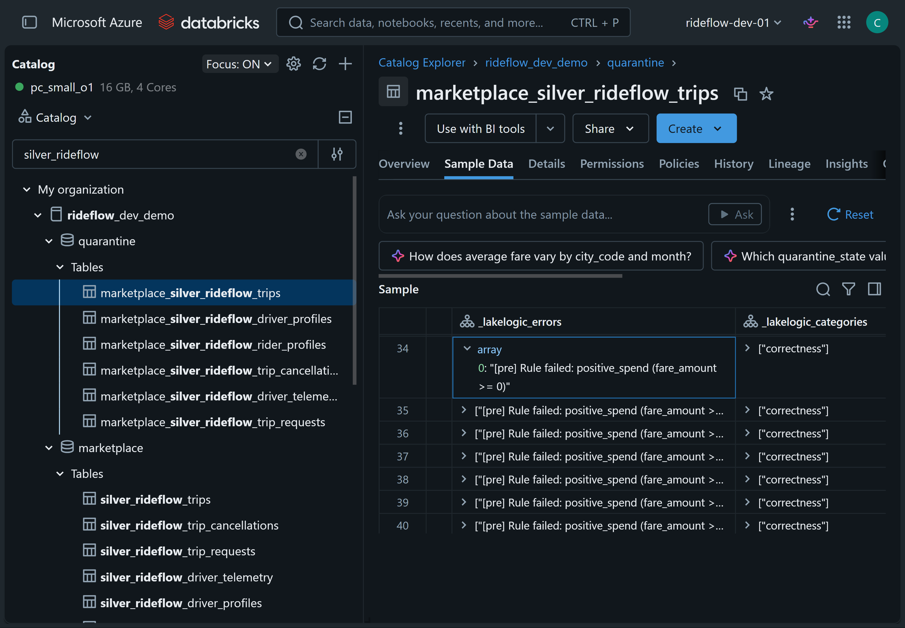

# Build a governed lakehouse on Databricks

Build data products with domain-owned YAML contracts, quality gates and
service-level objective (SLO) checks. Inspect rejected records, evaluate retention
policies and track erasure requests with recorded evidence.

**LakeLogic Databricks Lakehouse** is an open-source reference project built with
[LakeLogic Core](https://pypi.org/project/lakelogic/), Databricks Workflows and Unity
Catalog. Start with one Marketplace pipeline, then explore products across six
domains.

> RideFlow is a fictional ride-hailing and food-delivery business. All source data
> is synthetic. This community project is not an official Databricks product.
> No LakeLogic account or API key is required for the core demo.

## What you'll build

Start with completed-trip facts and rider and driver dimensions for analytics.
Then explore the monitoring and privacy workflows.

- **Deliver usable data:** build facts and dimensions through contract-driven pipelines.
- **Reuse engineering logic:** run domain-owned definitions through shared runners and defaults.
- **Explain quality failures:** apply schema, row and dataset checks; retain rejected records with their failure reasons.
- **Evaluate service levels:** check data against domain-defined objectives and inspect the results.
- **Review retention:** identify data outside declared retention windows and record the observations.
- **Track erasure:** process scoped requests with dry-run support, recorded status and evidence.

**Medallion layers organise the data. Contracts define its expectations.**
Quarantine is a failure path, not a fourth layer: valid rows can continue when
policy permits, while dataset gates can stop a run.



## Quickstart

### Before you start

You need a Databricks workspace with Unity Catalog and serverless compute,
an authenticated [Databricks CLI](https://docs.databricks.com/dev-tools/cli/)
(v0.220 or later), and permission to create the demo catalog, schemas and Volumes.
For an administrator-created catalog, see [catalog configuration](docs/catalog-configuration.md).

Use a dedicated demo environment. Databricks compute and storage charges or
workspace quotas apply independently of the open-source project.

### Deploy and run

Clone the current GitHub repository into a shorter local directory:

```bash
git clone https://github.com/LakeLogic/lakelogic-databricks-data-mesh-lakehouse.git lakelogic-databricks-lakehouse
cd lakelogic-databricks-lakehouse/databricks

databricks auth login --host https://<your-workspace-host> -p rideflow_dev
databricks -p rideflow_dev current-user me
```

**Before deploying:** review [bundle variables](databricks/databrick_variables.yml).
Replace the demo-specific `catalog_storage_root` with your permitted managed
storage location, or set it to an empty string if your metastore supplies one.
Keep `reset_catalog: "false"`; enabling it deletes and rebuilds the catalog.
Review [catalog configuration](docs/catalog-configuration.md) if using an existing catalog.

Run all bundle commands from this `databricks/` directory:

```bash
databricks bundle validate -t dev -p rideflow_dev
databricks bundle deploy -t dev -p rideflow_dev
databricks bundle run setup -t dev -p rideflow_dev
```

Setup creates the catalog resources, stages contracts, generates sample data,
runs **Marketplace** through bronze, silver and gold, and checks the outputs.
It does **not** populate every domain or run the separate SLO, retention and
erasure jobs. Explore those after loading the relevant data; review privacy-job
scope before execution. Setup time depends on your workspace.

### Check the result

In the Databricks SQL editor, run:

```sql
USE CATALOG governed_rideflow_lakehouse_demo;
SHOW TABLES IN marketplace;
SHOW TABLES IN quarantine;

SELECT *
FROM marketplace.gold_fact_trip_completed
LIMIT 20;
```

Use your own catalog name if you changed it. Inspect a quarantine table to see
which records failed and why.



## A data contract example

Data product contracts keep expectations beside the data they describe. This
project uses [Open Lakehouse Contracts](https://lakelogic.github.io/open-lakehouse-contract/).

Here is an excerpt from the completed-trip fact contract—not a standalone runnable file:

```yaml
version: 1.0.0

info:
  title: "Gold — Fact Trip Completed"
  table_name: "{gold_layer}_fact_trip_completed"
  description: "grain: one row per completed trip"
  target_layer: gold
  domain: marketplace
  system: rideflow

source:
  type: table
  path: "table:{domain_catalog}.{silver_layer}_rideflow_trips"
  load_mode: incremental
  watermark_field: _lakelogic_processed_at

primary_key: [trip_id]
```

The [complete contract](domains_rideflow/marketplace/rideflow/contracts/gold/gold_fact_trip_completed_v1.0.yaml)
also defines fields, the as-of lookups of `rider_sk` / `driver_sk` against the SCD2
rider and driver dimensions, and quality rules. Trip revenue is a business metric;
quality checks and freshness measures tell you whether the data supporting it
meets expectations.

## How the data products fit together

| Layer | Purpose in this example |
| --- | --- |
| Bronze | Capture source-aligned records with flexible schemas |
| Silver | Type, clean, transform and validate the data |
| Gold | Publish facts, dimensions and business metrics |

Marketplace, Payments, Operations, Marketing and Reference organise source data.
Shared products combine outputs across domains without duplicating every layer.

Contracts live in [`domains_rideflow/`](domains_rideflow/); Databricks deployment
and execution code lives in [`databricks/`](databricks/). Domain and system
configuration keeps ownership and shared expectations close to the teams responsible
for the data. Defaults reduce repeated configuration; declared dependencies support
data product lineage and execution order.

Databricks provides compute, storage, access control and job orchestration.
LakeLogic applies the contract-driven processing and checks.

## Inspect the evidence

A successful pipeline run is only part of the picture. Review each control's
results separately:

| Control | Evidence to inspect |
| --- | --- |
| Data quality | Rejected records, failed-rule context and pipeline run results |
| Service levels | SLO evaluation results against declared objectives |
| Retention | Observations in `_lakelogic_retention_evidence`; checks do not delete data |
| Erasure requests | Request statuses and `_lakelogic_erasure_evidence`; distinguish dry runs from execution |

These controls cover the configured lakehouse scope. An erasure result is not
proof of deletion from upstream systems, backups or every downstream copy.
See the [erasure request guide](docs/erasure-requests.md) before running privacy jobs.

## Test and explore

For local static checks, run from the repository root with the validator's Python
dependencies installed:

```bash
python scripts/validate_release.py
```

Read the output for skipped checks. Static validation is not a Databricks runtime
test; the bootstrap smoke test and output inspection provide separate evidence.

To run another source system after deployment:

```bash
# From databricks/
databricks bundle run payments_stripe -t dev -p rideflow_dev
```

| Next step | Guide |
| --- | --- |
| Explore domains, lineage, SCD Type 2 and repository layout | [Architecture and reference](docs/architecture-reference.md) |
| Set up without the CLI | [Notebook setup](docs/no-cli-setup.md) |
| Run each stage separately | [Manual run](docs/manual-run.md) |
| Change catalog or permissions | [Catalog configuration](docs/catalog-configuration.md) |
| Resolve deployment or cleanup issues | [Troubleshooting](docs/troubleshooting.md) |

## Boundaries and safety

This is a synthetic-data reference, not production acceptance evidence. Review
permissions, rules, dependencies and package versions before adapting it.
The default configuration installs the latest public LakeLogic release; pin
`lakelogic_version` for repeatable environments.

Retention reporting does not delete data. Erasure tooling needs separate review
and authorisation; privacy metadata alone does not establish regulatory compliance.

The LakeLogic platform is optional and separate from this demo. If enabling its
telemetry integration, review the transmitted fields and store credentials in a
Databricks secret scope—never in contracts or notebooks.

### Clean up

**Destructive:** the second command deletes the catalog and its schemas, tables,
Volumes and data. Verify the name and remove only resources belonging to this demo.

```bash
# From databricks/; replace the catalog name if you changed it.
databricks bundle destroy -t dev -p rideflow_dev
databricks catalogs delete governed_rideflow_lakehouse_demo --force -p rideflow_dev
```

The bundle manages jobs and synced files; catalog resources are created at runtime
and require separate cleanup.

## Build your own

Start by adapting one contract and testing it against your data.

[LakeLogic documentation](https://lakelogic.github.io/LakeLogic/) ·
[Python package](https://pypi.org/project/lakelogic/) ·
[Apache 2.0 licence](LICENSE)
