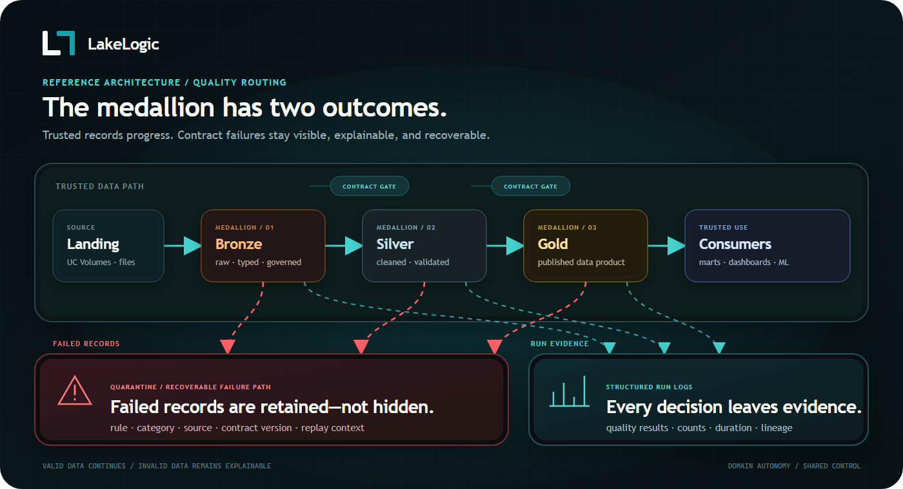
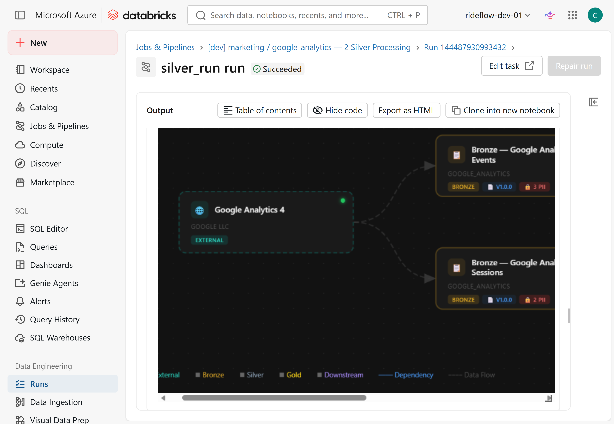
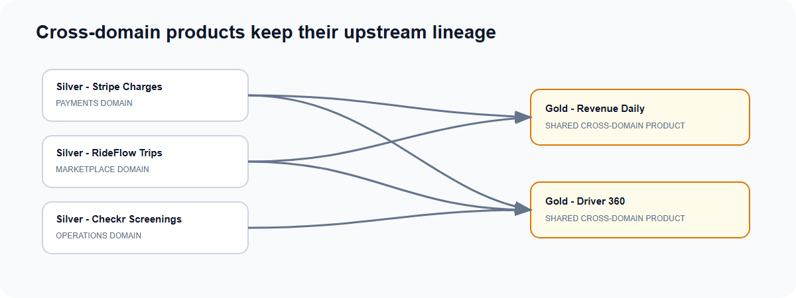
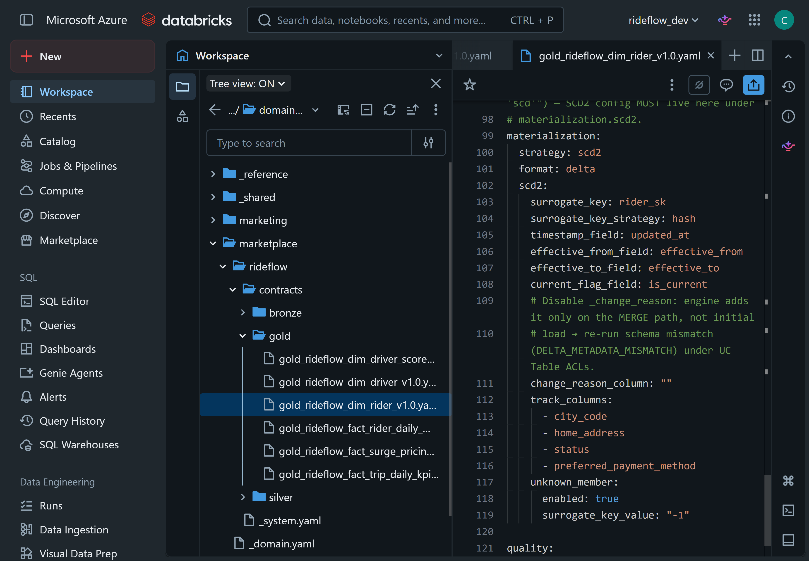
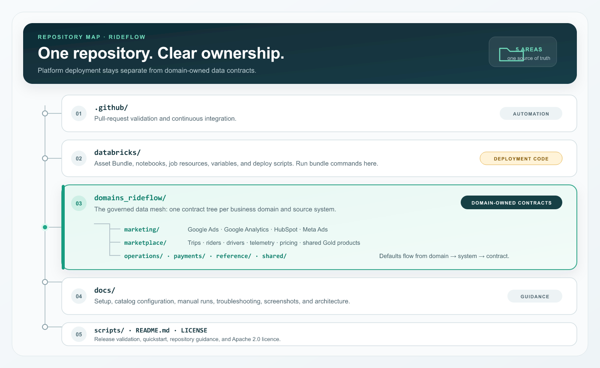

# Architecture and reference

[Back to the quickstart](../README.md)

Detailed examples and repository layout for the RideFlow reference lakehouse.

## Reference estate

```text
RideFlow · one Databricks lakehouse (Unity Catalog) · 6 domains · 11 source systems
Source-processing domains use the medallion pattern — Bronze (raw, all-string, schema-flexible) → Silver (typed, cleaned, transformed, validated) → Gold (products)
│
├── Marketplace   (rideflow)                          ← shown expanded as the example
│   ├── Bronze   raw · all-string · schema-flexible (evolves, keeps everything)
│   │     driver_profiles · rider_profiles · driver_telemetry · rider_app_events
│   │     trip_requests · trip_completed · trip_cancellations
│   ├── Silver   typed, cleaned, deduped, transformed, validated
│   │     driver_profiles · rider_profiles · trips (joined) · trip_requests
│   │     driver_telemetry · rider_app_events
│   └── Gold   business products
│         dim_driver_profiles · dim_rider_profiles (SCD2) · code dims (trip_type, vehicle_type, …)
│         fact_trip_completed · fact_trip_requests · fact_trip_cancellations
│         fact_driver_telemetry · fact_rider_app_events
│
├── Payments     (stripe)        →  Bronze → Silver → Gold   ·  charges, payouts
├── Operations   (checkr · twilio · zendesk)   →  Bronze → Silver → Gold
├── Marketing    (google_ads · google_analytics · hubspot · meta_ads)   →  Bronze → Silver → Gold
├── Reference    (internal)      →  Bronze → Silver → Gold   ·  cities, fx rates
└── Shared       (cross-domain marts)   →  Gold   ·  products that join every domain
```


*Six RideFlow domains publish governed data products through Unity Catalog. LakeLogic Core applies
the shared contract controls and records quarantine and run evidence.*


## How the architecture works

Source-processing domains own Bronze, Silver, and Gold definitions. Shared products consume other domains' outputs directly. Shared
settings can be inherited from `_domain.yaml` and `_system.yaml`; individual
contracts keep dataset-specific rules beside the team that understands the data.

The repository contains 66 contracts across Marketplace, Marketing, Payments,
Operations, Reference, and Shared. The examples include CSV, JSON, unstructured
PDF input, external Python logic, cross-domain Gold products, row-level lineage
tags, freshness and volume SLOs, and an engine-agnostic pipeline DAG.

### Medallion plus quarantine



*Contracts govern every layer. Row failures can enter quarantine while valid rows
continue; dataset gates can still stop an unsafe run.*

Quarantine is a failure path, not another medallion layer. A rejected row retains
the failed rule and source context. Structured run logs record what passed, what
failed, and how long each contract took.

### Dependency-aware execution

Contracts declare `depends_on` edges. LakeLogic builds the directed acyclic graph
and processes products in dependency order, including dependencies within the
same medallion layer.



### Cross-domain products

Shared Gold products can consume products owned by other domains. Their declared
dependencies preserve lineage across team boundaries.



*The shared revenue and driver products depend on data owned by Payments,
Marketplace, and Operations.*

### SCD Type 2

Gold contracts can declare SCD Type 2 materialization, including tracked columns,
surrogate keys, effective dates, current-version flags, and an unknown member.




## What gets created

```text
Catalog: governed_rideflow_lakehouse_demo
├── nondelta
│   ├── _contracts       Unity Catalog Volume containing the staged registry
│   ├── _logs            Unity Catalog Volume containing pipeline run logs
│   └── landing_<domain> Unity Catalog Volume containing source data
├── quarantine           Contract-failing rows
├── marketplace          Bronze, Silver, and Gold Delta tables
├── marketing
├── payments
├── operations
├── reference            Shared lookups and conformed dimensions
└── shared               Cross-domain marts
```

## Repository layout

The repository keeps reusable data-product definitions separate from the code
that deploys and runs them on Databricks:



```text
.github/
  workflows/validate.yml      CI validation for contracts and Python files
domains_rideflow/             Domain-owned contract trees
  marketing/                  Google Ads, Google Analytics, HubSpot, and Meta Ads
    <system>/
      _system.yaml             System defaults and contract registry
      contracts/
        bronze/                Source-aligned ingestion contracts
        silver/                Cleaned and conformed data products
        gold/                  Business-facing facts, dimensions, and aggregates
  marketplace/                Trips, riders, drivers, telemetry, and pricing
  operations/                 Screening, support, licensing, and operations data
  payments/                   Charges, refunds, payouts, and financial products
  reference/                  Shared lookups and conformed reference data
  shared/                     Cross-domain products and marts
databricks/
  databricks.yml              Asset Bundle targets
  databrick_variables.yml     Shared bundle variables
  deploy.ps1 / deploy.sh      Windows and Unix deployment wrappers
  notebooks/
    nb_00_setup.py            Catalog, schema, Volume, and contract setup
    nb_pipeline_driver.py     Registry-driven Bronze, Silver, and Gold runner
    nb_test_data_driver.py    Synthetic landing-data generator
    nb_slo_checks.py          Service-level (freshness / row-count) checks
    nb_maintenance_optimize.py  Delta OPTIMIZE + VACUUM
    nb_compliance_retention_check.py  Read-only retention check
    nb_compliance_erasure.py  Data-subject erasure tooling, dry run by default
    _ops/                     Run gates and smoke tests (nb_assert_*, nb_release_smoke_test)
    _helpers/                 Inspection and validation helpers
  resources/                  Jobs, grouped as LakeLogic Build Centre renders them
    admin/                    pl_admin_setup (one-click bootstrap), pl_admin_maintenance_<domain>_<system>
    data/                     pl_data_00_mesh_orchestrator, pl_data_<domain>_<system>_{bronze,silver,gold,orchestrator}
    monitor/                  pl_monitor_slo_<domain>_<system>
    privacy/                  pl_privacy_retention, pl_privacy_erasure
    test/                     pl_test_synthetic_seed (all domains), pl_test_synthetic_seed_<domain>_<system>
docs/                         Alternative setup and troubleshooting guides
  images/                     README screenshots and architecture diagrams
scripts/
  validate_release.py         Static checks used locally and in CI
README.md                     Public overview and quickstart
LICENSE                       Apache 2.0 licence
```

`domains_rideflow/` contains the portable business definitions. `databricks/`
contains the platform-specific deployment and execution code. This boundary is
intentional: a domain team can review its contracts without needing to understand
the complete Asset Bundle, while the platform team can change deployment code
without moving business rules into notebooks.
