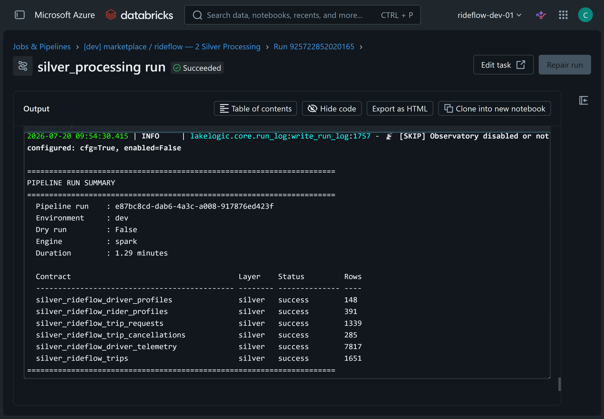

# Run the RideFlow demo step by step

The one-click bootstrap job chains the setup, test-data, and pipeline notebooks together. This guide runs the same flow manually so you can inspect each stage.

The examples use the `marketplace / rideflow` system and the default `rideflow_dev_demo` catalog.

## 1. Provision the structures

Open `databricks/notebooks/_ops/provision_all`, leave the `catalog` widget set to `rideflow_dev_demo`, and select **Run All**.

The notebook creates:

- One Unity Catalog schema per domain
- The `quarantine` schema
- The `nondelta` schema
- `_contracts`, `_logs`, and landing Unity Catalog Volumes
- Empty Bronze, Silver, and Gold tables derived from the contracts

## 2. Generate landing data

Open `databricks/notebooks/test_data_driver.py` and set:

```text
registry_path = /Volumes/rideflow_dev_demo/nondelta/_contracts/marketplace/rideflow/_system.yaml
environment = dev
inject_edge_cases = true
```

Select **Run All**. The notebook writes synthetic RideFlow data into the marketplace landing Volume. Deliberate edge cases are included so that contract failures can be inspected later.

## 3. Process the medallion

Open `databricks/notebooks/pipeline_driver.py` and set:

```text
registry_path = /Volumes/rideflow_dev_demo/nondelta/_contracts/marketplace/rideflow/_system.yaml
environment = dev
engine = spark
storage_mode = uc
target_layers = bronze,silver,gold
```

Select **Run All**. LakeLogic resolves the declared dependencies and processes Bronze, Silver, and Gold in order. Rows that fail configured contract rules are routed to quarantine when policy allows the valid rows to continue.



The structured run log records contract status, row counts, engine, and duration for each stage.

> `pipeline_driver` defaults to resetting and recreating the selected layers for clean demo runs. Keep `reset_layers` enabled for a fresh run. Disable it only when you intentionally want append behaviour.

## 4. Inspect the outputs

Run the following in a Databricks SQL editor:

```sql
USE CATALOG rideflow_dev_demo;
SHOW SCHEMAS;
SHOW TABLES IN marketplace;
SHOW TABLES IN quarantine;

SELECT *
FROM marketplace.gold_rideflow_fact_trip_daily_kpis
LIMIT 20;
```

Then select one of the tables returned by `SHOW TABLES IN quarantine` and inspect its failed rows and error context. You can also run `databricks/notebooks/_helpers/inspect_quarantine`.

## Run another domain

Point both drivers at another staged system registry, for example:

```text
/Volumes/rideflow_dev_demo/nondelta/_contracts/payments/stripe/_system.yaml
```

Run the test-data driver and pipeline driver again. Table names and dependencies are resolved from the contracts under `domains_rideflow/`.

If you deployed the Asset Bundle, you can instead run a domain orchestrator:

```bash
databricks bundle run payments_orchestrator_stripe -t dev -p rideflow_dev
databricks bundle run marketing_orchestrator_google_ads -t dev -p rideflow_dev
```

## Clean up

If you deployed the bundle, run both commands from `databricks/`:

```bash
databricks bundle destroy -t dev -p rideflow_dev
databricks catalogs delete rideflow_dev_demo --force -p rideflow_dev
```

If you used only the direct notebook path, the catalog deletion is sufficient because no bundle-managed jobs or workspace files were deployed.
